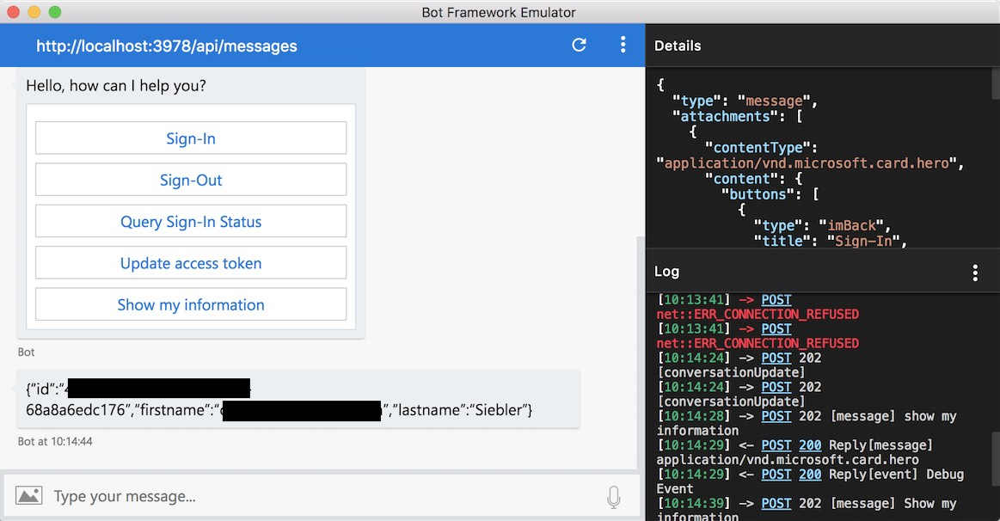

# OAuth 2.0 Device Code Flow Authentication with Azure Bot Framework - Example

# Overview

This is a basic example of using Azure Active Directory (AAD) Authentication using OAuth 2.0 Device Code Flow with Azure Bot Service in Node.js. Full details can be found in this [blog post](https://clemenssiebler.com/blog/2018/05/azure-active-directory-authentication-using-oauth-2.0-device-code-flow-with-azure-bot-service-and-node.js/).



## Instructions

First, create a new Storage Account in Azure, copy the connection string and also create an empty Table for persisting the bot's state. Then register your bot as an `Native Application` in the [Application Registration Portal](https://apps.dev.microsoft.com) (make sure you're signed into the right AAD):

1. Open [Apps Dev Portal](https://apps.dev.microsoft.com) and click `Add an app`
1. Give our app a name
1. Click on the new app and note the Application Id (this will become your `AZUREAD_APP_ID`)
1. Under `Platforms`, click `Add Platform` and choose `Native Application`

Then, in a terminal, execute:

```
$ git clone https://github.com/csiebler/bot-service-device-flow-authentication.git
$ cd bot-service-device-flow-authentication
$ npm install
$ cp .env.template .env
$ vi .env
```

Setup your `.env` file with

```
BOT_STATE_TABLE= # Name of the table you've created for persiting the bot's state
STORAGE_ACCOUNT_CONNECTION= # the associated storage connection
AZUREAD_ID= # the ID of your Azure Active Directory (see below)
AZUREAD_APP_ID= # The App ID of the app you've just created
```

You can find your `AZUREAD_ID` by going to the Azure Portal, switching to the correct Azure Active Directory and clicking `Properties` --> `Directory ID`. Lastly, start your bot:

```
$ node app.js
```

Then connect to `http://localhost:3978/api/messages` via the [Bot Framework Emulator](https://aka.ms/botemulator). No App Id or App Password needed.

Alternatively, you can directly run the example code from VS Code.

## Suggestions & Questions

If you have any suggestions or questions, feel free to reach out to me via [@clemenssiebler](https://twitter.com/clemenssiebler)!

## License

Licensed using the MIT License (MIT). For more information, please see [LICENSE](LICENSE).